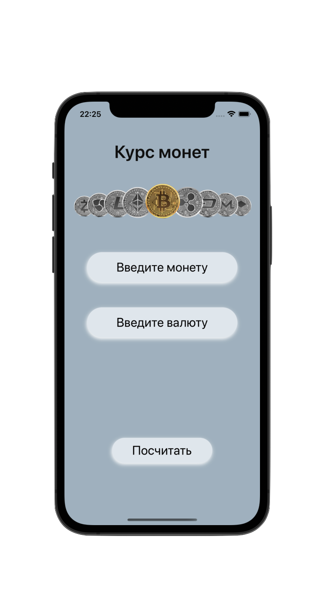
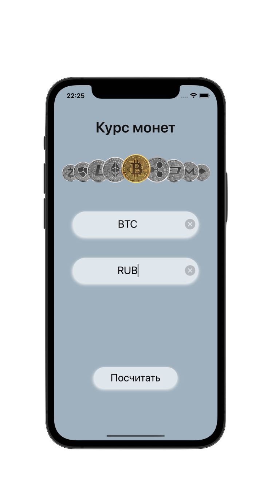
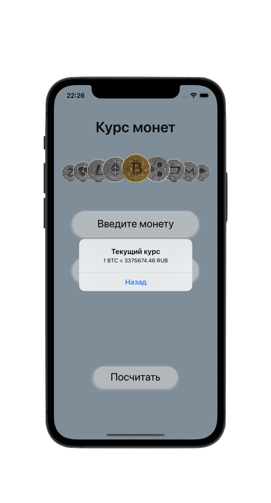

#  Crypto Exchange 

## An application for tracking exchange rates and cryptocurrencies.

## Frameworks
- [x] UIKit

## Technologies
- [x] UI in code
- [x] URLSession
- [x] Async/await
- [x] Delegate

## Screenshots
    

## Contact me
[LinkedIn](https://www.linkedin.com/in/nikita-semennikov-73a020253/ "https://www.linkedin.com/in/nikita-semennikov-73a020253/") | [Telegram](https://t.me/NikitaAndreevich10 "@NikitaAndreevich10") | [Email](mailto:semennikovna@yandex.ru "semennikovna@yandex.ru")
